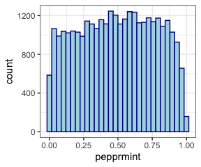

# Read in PEPPRMINT estimates

```r
pf = list.files("../output_PEPPRMINT", pattern=".txt", full.names=TRUE)
length(pf)
```

```
## [1] 30
```

```r
pf[1]
```

```
## [1] "../output_PEPPRMINT/PEPPRMINT_Riaz_2017_200_split0_test_pred.txt"
```

```r
pf = pf[grep("Riaz_2017_ref", pf)]
length(pf)
```

```
## [1] 15
```

```r
pf[1]
```

```
## [1] "../output_PEPPRMINT/PEPPRMINT_Riaz_2017_ref_200_split0_test_pred.txt"
```

```r
for(i in 1:length(pf)){
  pfi = pf[i]
  pdi = fread(pfi)
  
  if(i == 1){
    pd1 = pdi
  }else{
    stopifnot(all(pd1$key == pdi$key))
    stopifnot(all(pd1$sample == pdi$sample))
    
    pd1 = cbind(pd1, pdi$y_pred)
  }
  
  mtag = str_extract(pfi, "(?<=PEPPRMINT_Riaz_2017_ref_)\\S+(?=_test)")

  names(pd1)[i+2] = mtag
}

dim(pd1)
```

```
## [1] 31298    17
```

```r
pd1[1:2,]
```

<div data-pagedtable="false">
  <script data-pagedtable-source type="application/json">
{"columns":[{"label":["key"],"name":[1],"type":["chr"],"align":["left"]},{"label":["sample"],"name":[2],"type":["chr"],"align":["left"]},{"label":["200_split0"],"name":[3],"type":["dbl"],"align":["right"]},{"label":["200_split1"],"name":[4],"type":["dbl"],"align":["right"]},{"label":["200_split2"],"name":[5],"type":["dbl"],"align":["right"]},{"label":["200_split3"],"name":[6],"type":["dbl"],"align":["right"]},{"label":["200_split4"],"name":[7],"type":["dbl"],"align":["right"]},{"label":["400_split0"],"name":[8],"type":["dbl"],"align":["right"]},{"label":["400_split1"],"name":[9],"type":["dbl"],"align":["right"]},{"label":["400_split2"],"name":[10],"type":["dbl"],"align":["right"]},{"label":["400_split3"],"name":[11],"type":["dbl"],"align":["right"]},{"label":["400_split4"],"name":[12],"type":["dbl"],"align":["right"]},{"label":["800_split0"],"name":[13],"type":["dbl"],"align":["right"]},{"label":["800_split1"],"name":[14],"type":["dbl"],"align":["right"]},{"label":["800_split2"],"name":[15],"type":["dbl"],"align":["right"]},{"label":["800_split3"],"name":[16],"type":["dbl"],"align":["right"]},{"label":["800_split4"],"name":[17],"type":["dbl"],"align":["right"]}],"data":[{"1":"10:100063709:G:A","2":"Pt65_pre","3":"0.4685","4":"0.6660","5":"0.6080","6":"0.6757","7":"0.7378","8":"0.4753","9":"0.4871","10":"0.4481","11":"0.5639","12":"0.6487","13":"0.4086","14":"0.4322","15":"0.5796","16":"0.5277","17":"0.7930"},{"1":"10:100065294:C:T","2":"Pt54_pre","3":"0.2877","4":"0.3538","5":"0.3752","6":"0.3687","7":"0.4389","8":"0.3773","9":"0.3126","10":"0.4389","11":"0.2943","12":"0.3495","13":"0.4285","14":"0.2448","15":"0.3752","16":"0.3990","17":"0.3505"}],"options":{"columns":{"min":{},"max":[10]},"rows":{"min":[10],"max":[10]},"pages":{}}}
  </script>
</div>

# check the correlation of prediction across model configurations

```r
pd1 = as.data.frame(pd1)
cr1 = cor(pd1[,-(1:2)])
summary(cr1[upper.tri(cr1)])
```

```
##    Min. 1st Qu.  Median    Mean 3rd Qu.    Max. 
##  0.8333  0.8719  0.8888  0.8853  0.8990  0.9307
```

```r
g0 = ggcorrplot(cr1) + 
  scale_fill_gradient(limit = c(0.8,1), low = "white", high =  "red")
```

```
## Scale for 'fill' is already present. Adding another scale for 'fill', which
## will replace the existing scale.
```

```r
pdf("step3b_aggregate_pepprmint_ref_files/ggcot_ref.pdf", width=5.5, height=5)
g0
dev.off()
```

```
## quartz_off_screen 
##                 2
```

# Average the prediction score and check their distribution

```r
pd2 = pd1[,1:2]
pd2$pepprmint = rowMeans(pd1[,-(1:2)])

dim(pd2)
```

```
## [1] 31298     3
```

```r
pd2[1:2,]
```

<div data-pagedtable="false">
  <script data-pagedtable-source type="application/json">
{"columns":[{"label":[""],"name":["_rn_"],"type":[""],"align":["left"]},{"label":["key"],"name":[1],"type":["chr"],"align":["left"]},{"label":["sample"],"name":[2],"type":["chr"],"align":["left"]},{"label":["pepprmint"],"name":[3],"type":["dbl"],"align":["right"]}],"data":[{"1":"10:100063709:G:A","2":"Pt65_pre","3":"0.5680133","_rn_":"1"},{"1":"10:100065294:C:T","2":"Pt54_pre","3":"0.3596600","_rn_":"2"}],"options":{"columns":{"min":{},"max":[10]},"rows":{"min":[10],"max":[10]},"pages":{}}}
  </script>
</div>

```r
g1 = ggplot(pd2, aes(x=pepprmint))+
  geom_histogram(color="darkblue", fill="lightblue")
g1
```

```
## `stat_bin()` using `bins = 30`. Pick better value with `binwidth`.
```

<!-- -->

# write out results

```r
fwrite(pd2, 
       file = "../output_PEPPRMINT/PEPPRMINT_Riaz_2017_ref_aggregate.tsv", 
       sep = "\t")
```


```r
sessionInfo()
```

```
## R version 4.0.3 (2020-10-10)
## Platform: x86_64-apple-darwin17.0 (64-bit)
## Running under: macOS Big Sur 10.16
## 
## Matrix products: default
## BLAS:   /Library/Frameworks/R.framework/Versions/4.0/Resources/lib/libRblas.dylib
## LAPACK: /Library/Frameworks/R.framework/Versions/4.0/Resources/lib/libRlapack.dylib
## 
## locale:
## [1] en_US.UTF-8/en_US.UTF-8/en_US.UTF-8/C/en_US.UTF-8/en_US.UTF-8
## 
## attached base packages:
## [1] stats     graphics  grDevices utils     datasets  methods   base     
## 
## other attached packages:
## [1] ggcorrplot_0.1.3     stringr_1.4.0        ggpointdensity_0.1.0
## [4] ggplot2_3.3.3        data.table_1.13.6   
## 
## loaded via a namespace (and not attached):
##  [1] Rcpp_1.0.5       pillar_1.4.7     compiler_4.0.3   plyr_1.8.6      
##  [5] tools_4.0.3      digest_0.6.27    jsonlite_1.7.2   evaluate_0.14   
##  [9] lifecycle_0.2.0  tibble_3.0.4     gtable_0.3.0     pkgconfig_2.0.3 
## [13] rlang_0.4.10     yaml_2.2.1       xfun_0.19        withr_2.3.0     
## [17] dplyr_1.0.2      knitr_1.30       generics_0.1.0   vctrs_0.3.6     
## [21] grid_4.0.3       tidyselect_1.1.0 glue_1.4.2       R6_2.5.0        
## [25] rmarkdown_2.6    farver_2.0.3     purrr_0.3.4      reshape2_1.4.4  
## [29] magrittr_2.0.1   scales_1.1.1     ellipsis_0.3.1   htmltools_0.5.0 
## [33] colorspace_2.0-0 labeling_0.4.2   stringi_1.5.3    munsell_0.5.0   
## [37] crayon_1.3.4
```
